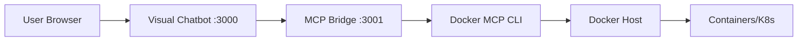

# Docker MCP Integration Setup

This document explains how to set up Docker MCP integration with the Visual Chatbot using the HTTP MCP bridge.

## Problem Solved

The Visual Chatbot runs inside a container and cannot directly access Docker MCP tools because:
- Docker MCP requires Docker socket access
- Container isolation prevents direct MCP server communication
- Traditional MCP uses stdio transport which doesn't work across containers

## Solution: HTTP MCP Bridge

The HTTP bridge acts as a proxy between the containerized Visual Chatbot and Docker MCP tools running on the host.

```
Visual Chatbot Container → HTTP Bridge Container → Docker MCP Tools → Docker Host
```

## Quick Setup

### 1. Start with Docker Compose
```bash
docker-compose up -d
```

This will start both services:
- **MCP Bridge** on port 3001 (with Docker access)
- **Visual Chatbot** on port 3000 (connects to bridge)

### 2. Verify Setup
```bash
# Check bridge health
curl http://localhost:3001/health

# Check visual chatbot health  
curl http://localhost:3000/health

# Test bridge functionality
curl http://localhost:3001/test
```

### 3. Access the Application
1. Open http://localhost:3000
2. Go to "Tool graph" to see available tools
3. You should see Docker MCP tools like:
   - `docker-mcp__docker`
   - `docker-mcp__kubectl_get`
   - `docker-mcp__get_file_contents`
   - etc.

## Manual Setup (Alternative)

If you prefer to run components separately:

### 1. Start MCP Bridge on Host
```bash
cd mcp-bridge
npm install
node mcp-http-bridge.js
```

### 2. Run Visual Chatbot
```bash
# Build and run the visual chatbot container
docker build -t visual-chatbot .
docker run -d -p 3000:3000 \
  -e MCP_BRIDGE_URL=http://host.docker.internal:3001 \
  visual-chatbot
```

## Adding Docker MCP Gateway via UI

If automatic connection fails, manually add via the UI:

1. Open the Visual Chatbot at http://localhost:3000
2. Navigate to MCP servers section
3. Click "+ Add Docker MCP Gateway"
4. Choose connection type:
   - **Extension**: Uses `http://host.docker.internal:3001`
   - **Native**: Uses `http://localhost:3001`

## Architecture

### Components

1. **Visual Chatbot Container**
   - Main application with web UI
   - Makes HTTP requests to MCP bridge
   - No Docker dependencies

2. **MCP HTTP Bridge Container**
   - Exposes HTTP endpoints for MCP tools
   - Has Docker CLI and docker-mcp installed
   - Mounted Docker socket for host access

3. **Docker Host**
   - Runs containers and Kubernetes
   - Accessible via Docker socket

### Network Flow



## Available Tools

The Docker MCP integration provides access to:

### Docker Tools
- `docker`: Execute Docker CLI commands
- Container management
- Image operations
- Network and volume management

### Kubernetes Tools  
- `kubectl_get`: List/get K8s resources
- `kubectl_describe`: Describe resources
- `kubectl_logs`: Get pod logs
- `kubectl_apply`: Apply manifests

### GitHub Tools
- `get_file_contents`: Read repository files
- `create_or_update_file`: Create/update files
- `list_pull_requests`: List PRs

## Troubleshooting

### Bridge Connection Issues

**Problem**: Visual Chatbot can't connect to bridge
```bash
# Check if bridge is running
docker-compose ps mcp-bridge

# Check bridge logs
docker-compose logs mcp-bridge

# Test bridge directly
curl http://localhost:3001/health
```

**Solution**: Ensure bridge is healthy and network connectivity exists

### Docker MCP Tools Not Working

**Problem**: Tools fail with permission errors
```bash
# Test Docker access from bridge
docker-compose exec mcp-bridge docker ps

# Test MCP tools directly
docker-compose exec mcp-bridge docker mcp tools list
```

**Solution**: Verify Docker socket is mounted and docker-mcp is installed

### Container Networking Issues

**Problem**: Services can't communicate
```bash
# Check network configuration
docker network ls
docker network inspect visual-chatbot_chatbot-network
```

**Solution**: Ensure both containers are on the same network

## Development

### Local Development

For development, you can run the bridge locally:

```bash
cd mcp-bridge
npm install
npm run dev  # Uses nodemon for auto-restart
```

Then update the Visual Chatbot to use `http://localhost:3001`

### Adding New Tools

To add new MCP tools to the bridge:

1. Update `httpMcpServer.mjs` with new tool definitions
2. Ensure the tool exists in docker-mcp
3. Test via bridge endpoints

### Bridge API

The bridge exposes these endpoints:

- `GET /health` - Health check
- `GET /test` - Test MCP connectivity  
- `POST /tools/{toolName}` - Generic tool execution
- `POST /tools/create_or_update_file` - Specific GitHub tool

## Security Considerations

- Bridge has full Docker access via socket
- Run bridge in isolated network
- Consider implementing authentication for production
- Limit tool access based on user permissions

## Performance

- HTTP bridge adds ~50-100ms latency per tool call
- Suitable for interactive use, not high-frequency automation
- Consider connection pooling for production loads

## Benefits

✅ **Container Isolation**: Visual Chatbot stays containerized
✅ **Easy Development**: Bridge can be developed independently  
✅ **HTTP Interface**: Easy to debug and monitor
✅ **Scalable**: Multiple clients can use same bridge
✅ **Production Ready**: Health checks and error handling
✅ **Flexible**: Works with any MCP tools, not just Docker